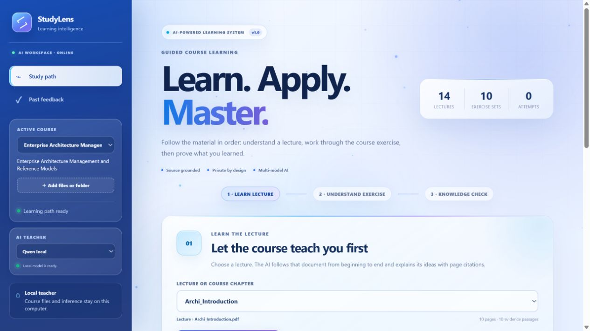
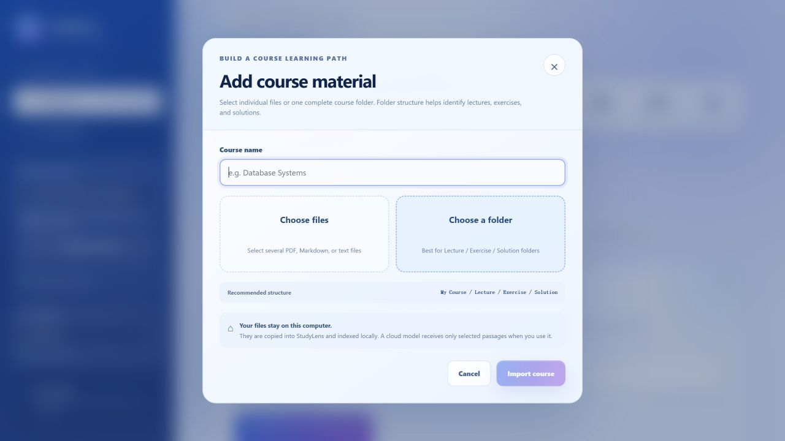
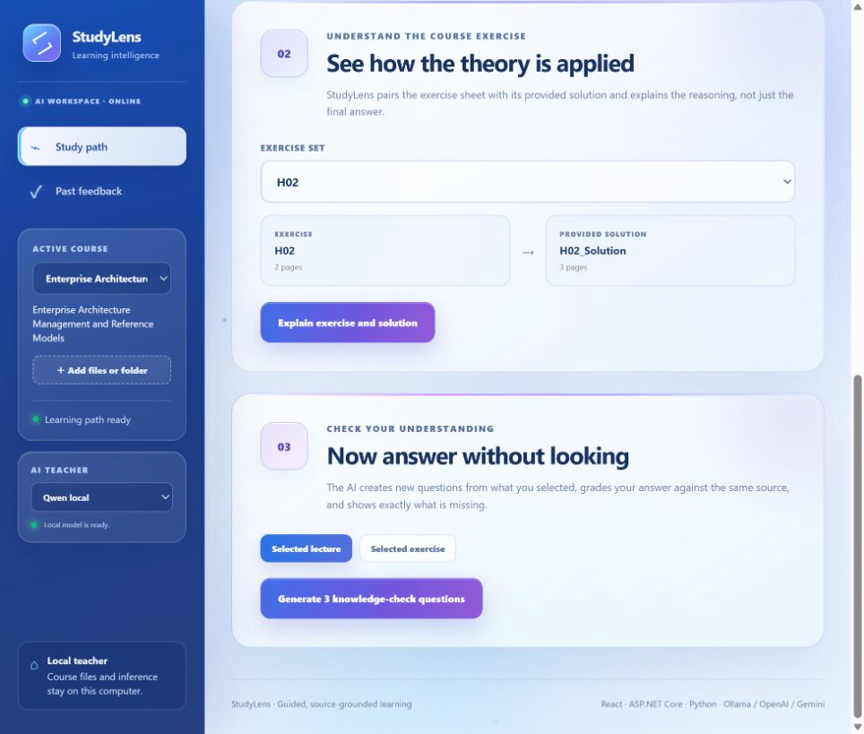
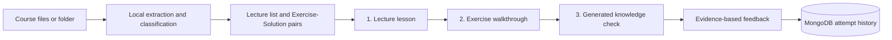

# StudyLens


StudyLens is a multi-course, source-grounded AI learning companion for real study material. Its primary workflow teaches a selected lecture, explains the course's own exercise and solution, then generates a knowledge check and grades the student's answer against the same source.

A clean clone includes a small original demo course and retrieval benchmark. The private reference deployment uses TUM's **Enterprise Architecture Management and Reference Models (INHN0017)** corpus: 52 PDFs, 926 pages, and 967 searchable chunks. Those copyrighted files and their extracted index remain local and are not committed.



<table>
  <tr>
    <td width="50%"></td>
    <td width="50%"></td>
  </tr>
  <tr>
    <td align="center"><strong>Flexible course import</strong><br/>Preserves Lecture / Exercise / Solution folders and skips unsupported formats.</td>
    <td align="center"><strong>Guided learning loop</strong><br/>Teach the lecture, explain the provided solution, then test understanding.</td>
  </tr>
</table>

The screenshots are from the running local EAM reference deployment. Private course files and extracted text are excluded from Git.

## Product workflow



This is more than a PDF chatbot:

- retrieval is deterministic and evaluated separately from generation;
- the model receives only selected passages from the chosen lecture or exercise set;
- every generated workflow retains the original document and page;
- practice and grading use structured JSON rather than parsing prose;
- MongoDB stores the nested answer, feedback, model, and citation document as one attempt;
- the browser extension reads only text the user explicitly selects;
- model, AI provider, course catalog, and persistence adapter have separate boundaries.

## Implemented features

- file or whole-folder course import that preserves the Lecture/Exercise/Solution structure and skips unsupported files without rejecting the valid remainder;
- PDF, Markdown, and text ingestion with deterministic overlapping chunks;
- BM25-style lexical retrieval and lecture/exercise/solution/exam filters;
- safe links back to the original local material page;
- inline PNG previews of cited PDF pages, generated and cached locally;
- document-scoped lecture teaching with page citations, examples, and exam-ready English wording;
- automatic pairing and walkthrough of course-provided exercises and solutions;
- course-grounded knowledge-check generation and formative grading;
- MongoDB-backed attempt history, aggregate score, reload, and user-controlled deletion;
- privacy-controlled Chrome/Edge extension handoff;
- selectable local Qwen3.5, OpenAI GPT, and Google Gemini providers;
- public demo corpus plus fixed retrieval evaluation cases;
- Python, C#, API, formatting, dashboard, and extension checks in CI.

## Run a clean clone

Requirements: Windows, Node.js, .NET 10, Python 3.12 for indexing/tests/page previews, Ollama, and MongoDB Community Server. The startup script installs the small Python packages in `tools/requirements.txt` if they are missing.

Install or start MongoDB:

```powershell
powershell -ExecutionPolicy Bypass -File scripts\setup-mongodb.ps1 -Install
```

Install and test the default local model:

```powershell
powershell -ExecutionPolicy Bypass -File scripts\setup-local-ai.ps1
```

Start the application:

```powershell
powershell -ExecutionPolicy Bypass -File scripts\run-local.ps1
```

Open `http://127.0.0.1:5080`. A clean clone starts with the committed **AI-Assisted Learning Demo** course. Keep the terminal open and press `Ctrl+C` to stop.

Use **Add files or folder** in the sidebar to import individual PDF, Markdown, or text files, or select an entire course folder. The browser preserves its internal paths. Folders named `Lecture`, `Exercise`, and `Solution` let StudyLens build the learning sequence and pair sheets with their answers automatically. The copied files and index stay under the ignored local `App_Data/imported-courses` folder and are rediscovered after a restart.

The default model is local Qwen through Ollama. Every local and cloud profile is selectable. An unconfigured profile opens provider-specific connection guidance; teaching actions remain unavailable until its runtime or API key is ready:

```powershell
# Gemini free tier
powershell -ExecutionPolicy Bypass -File scripts\setup-cloud-ai.ps1 -Provider Gemini

# OpenAI API (billed separately from a ChatGPT subscription)
powershell -ExecutionPolicy Bypass -File scripts\setup-cloud-ai.ps1 -Provider OpenAI
```

The script hides keyboard input and stores the key in the Windows user environment, never in this repository. Restart StudyLens afterward. Cloud requests contain only the selected question, instructions, and retrieved course passages, not the original complete files. Check the provider's current billing, quota, and data-use terms before using private material; Gemini's free and paid tiers have different data handling.

`GET /health` reports both course readiness and the live persistence provider. The expected storage result is `MongoDb`, connected to the local `studylens` database.

## Prepare the private EAM reference course

```powershell
powershell -ExecutionPolicy Bypass -File scripts\setup-eam.ps1 `
  -SourcePath "D:\Courses\Enterprise Architecture Management and Reference Models (INHN0017)"
```

The generated index and absolute source path go into ignored local files. They never enter Git.

Add any other course in the same way:

```powershell
powershell -ExecutionPolicy Bypass -File scripts\setup-course.ps1 `
  -CourseId "linear-algebra" `
  -CourseName "Linear Algebra" `
  -SourcePath "D:\Courses\Linear Algebra"
```

No React or C# change is required to add a course.

## Install the browser extension

Build it once:

```powershell
cd frontend\extension
npm ci
npm run build
```

Then open `chrome://extensions` or `edge://extensions`, enable **Developer mode**, choose **Load unpacked**, and select `frontend\extension\dist`.

On any ordinary page, select a concept, open StudyLens, review the selected text, choose a course, and click **Open in StudyLens**. The extension does not request cookies or browsing-history access. The selection is placed in a local URL fragment, consumed by the dashboard, and immediately removed from the address bar.

## MongoDB data model

The default repository is `MongoStudyAttemptRepository`; `LocalJsonStudyAttemptRepository` is an explicit fallback and test adapter, not the normal runtime path.

Each document in `studylens.study_attempts` contains:

- stable attempt ID and course ID;
- question and student answer;
- score, strengths, missing points, and improved answer;
- model name and full page-citation metadata;
- creation time.

A compound index on `(courseId, createdAtUtc descending)` supports course history. History is not committed to Git, and the UI exposes course-scoped deletion.

## Verification

```powershell
powershell -ExecutionPolicy Bypass -File scripts\verify.ps1
```

The current suite runs 5 Python indexing/rendering tests, 33 C# tests, .NET formatting verification, and lint/production builds for both React applications. CI deliberately uses fake AI providers and does not download multi-gigabyte model weights.

## Move to another computer

1. Push/clone this repository through GitHub.
2. Install MongoDB and Ollama on the new computer.
3. Copy private course files separately, then rerun `setup-course.ps1` for their new path.
4. Run `setup-local-ai.ps1`, `verify.ps1`, and `run-local.ps1`.
5. Expect a fresh local MongoDB history unless you separately export and import it.

GitHub synchronizes source code, the public demo, tests, and documentation. It intentionally does not synchronize private PDFs, model weights, local configuration, MongoDB student data, or this Codex conversation.

The portable default is `qwen3.5:4b` for the current 16 GB laptop. On the Ryzen/RTX 3060 laptop, evaluate the retained 9B profile:

```powershell
powershell -ExecutionPolicy Bypass -File scripts\setup-local-ai.ps1 -Model "qwen3.5:9b"
```

## API

| Method | Route | Purpose |
|---|---|---|
| `GET` | `/health` | course and MongoDB readiness |
| `GET` | `/api/courses` | configured courses and corpus status |
| `POST` | `/api/courses/import` | upload and locally index a new course |
| `GET` | `/api/courses/{courseId}/learning-path` | lectures and paired exercise/solution units |
| `GET` | `/api/courses/{courseId}/search?query=...` | ranked page evidence |
| `GET` | `/api/courses/{courseId}/chunks/{chunkId}` | complete retrieved passage for Dig in |
| `GET` | `/api/courses/{courseId}/documents/{documentId}` | safe original-material access |
| `GET` | `/api/courses/{courseId}/documents/{documentId}/pages/{page}/preview` | locally rendered cited-page image |
| `GET` | `/api/ai/status` | provider and model readiness |
| `POST` | `/api/courses/{courseId}/tutor/explain` | grounded bilingual teaching |
| `POST` | `/api/courses/{courseId}/tutor/lecture` | teach one selected lecture in sequence |
| `POST` | `/api/courses/{courseId}/tutor/exercise` | explain a course exercise with its solution |
| `POST` | `/api/courses/{courseId}/tutor/practice` | structured practice generation |
| `POST` | `/api/courses/{courseId}/tutor/grade` | formative feedback and persistence |
| `GET` | `/api/courses/{courseId}/history` | attempt metrics and recent records |
| `DELETE` | `/api/courses/{courseId}/history` | user-controlled course history deletion |

## Repository layout

```text
samples/                       public demo course and committed index
evals/                         fixed retrieval benchmark cases
tools/                         extraction, indexing, and Python tests
backend/StudyLens.Api/         ASP.NET Core API, retrieval, tutor, MongoDB
backend/StudyLens.Api.Tests/   unit, API, repository, and benchmark tests
frontend/dashboard/            React/TypeScript learning workspace
frontend/extension/            explicit-selection browser extension
scripts/                       setup, run, and verification automation
docs/                          local guide, handoff, and interview notes
```

## Safety and limitations

- Private material, local paths, model files, student work, and generated feedback are ignored by Git.
- AI feedback is study assistance, not an official course grade.
- Citations make output auditable; they do not guarantee the interpretation is correct.
- The lexical retriever can miss synonyms; hybrid semantic retrieval and OCR remain evaluation candidates.
- The project has engineering validation, but it does not yet claim measured learning-outcome improvement from a user study.
