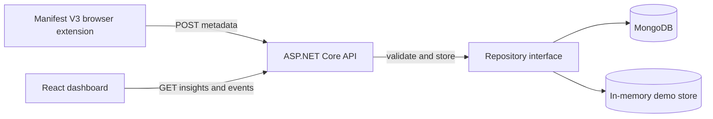

# StudyLens

StudyLens is a privacy-aware prototype that helps students reflect on how they use generative AI for learning. A browser extension records only user-approved metadata, an ASP.NET Core API validates and stores events, and a React dashboard turns them into an understandable weekly summary.

This repository is intentionally a focused MVP. The goal is to demonstrate a complete, testable data flow without collecting raw prompts or model responses.

## Problem

Students use tools such as ChatGPT, Claude and Gemini across many learning activities, but they have little visibility into their own patterns. Existing monitoring approaches can easily become invasive if they store conversation content.

StudyLens asks a narrower question: can useful reflection be created from content-free metadata such as duration, interaction count, learning activity and a self-reported helpfulness rating?

## Architecture



The extension and dashboard are separate React clients with different responsibilities. The API is the privacy and validation boundary. Storage is hidden behind `ILearningEventRepository`, allowing the application to use an in-memory store for a zero-setup demo and MongoDB for persistence.

## Privacy boundary

Collected:

- pseudonymous participant ID;
- AI provider and learning activity;
- session duration and interaction count;
- locally calculated prompt word count;
- user-provided helpfulness rating.

Never collected:

- raw prompts;
- model responses;
- page content;
- student name, email or TUM identifier.

The API rejects unknown JSON fields. A request containing `rawPrompt`, for example, returns HTTP 400 instead of silently ignoring or storing it. The extension requests only `storage` and `activeTab`, following the principle of least privilege.

## Technology

- React 19, TypeScript and Vite for the dashboard and browser-extension popup;
- ASP.NET Core 10 and C# 14 for the REST API;
- MongoDB .NET Driver with a replaceable repository abstraction;
- xUnit and `WebApplicationFactory` for unit and HTTP integration tests;
- GitHub Actions with a real MongoDB service for continuous integration;
- Chrome Extension Manifest V3.

## Repository layout

```text
backend/
  StudyLens.Api/          API, models, services and storage adapters
  StudyLens.Api.Tests/    unit and HTTP integration tests
frontend/
  dashboard/              reflection dashboard
  extension/              browser-extension popup and manifest
docs/
  interview-notes.zh-CN.md
```

## Run locally

Requirements:

- .NET 10 SDK;
- Node.js 24 or a compatible current LTS release;
- optional MongoDB instance or MongoDB Atlas connection.

Start the API:

```powershell
dotnet run --project backend/StudyLens.Api
```

Start the dashboard in a second terminal:

```powershell
cd frontend/dashboard
npm install
npm run dev
```

Open `http://127.0.0.1:5173` and select **Add demo data**.

The dashboard also lets the participant export all stored metadata as JSON or delete it. These controls demonstrate data portability and the right to erase prototype data.

Build the extension:

```powershell
cd frontend/extension
npm install
npm run build
```

Then open `chrome://extensions`, enable **Developer mode**, choose **Load unpacked**, and select `frontend/extension/dist`. Keep the API running while using the extension.

## Use MongoDB

The zero-setup demo uses the in-memory repository. To verify real persistence, start MongoDB and select the MongoDB adapter through configuration:

```powershell
$env:Storage__Provider = "MongoDb"
$env:MongoDb__ConnectionString = "mongodb://127.0.0.1:27017"
$env:MongoDb__DatabaseName = "studylens"
dotnet run --project backend/StudyLens.Api
```

Connection strings must stay in environment variables or local secret storage and must never be committed.
The repository creates a compound `participant_started_desc` index for participant-scoped, newest-first reads.

## API

| Method | Route | Purpose |
|---|---|---|
| `GET` | `/health` | Health and active storage provider |
| `POST` | `/api/events` | Validate and create a learning event |
| `GET` | `/api/events?participantId=...` | List one participant's events |
| `GET` | `/api/events/export?participantId=...` | Export one participant's metadata |
| `DELETE` | `/api/events?participantId=...` | Delete one participant's metadata |
| `GET` | `/api/insights?participantId=...` | Return aggregated dashboard metrics |
| `POST` | `/api/demo/seed?participantId=...` | Add synthetic local demo data |

Example requests are available in `backend/StudyLens.Api/StudyLens.Api.http`.

## Verification

```powershell
powershell -ExecutionPolicy Bypass -File scripts/verify.ps1
```

Set `$env:RUN_MONGODB_INTEGRATION_TESTS = "true"` before running the script to include the local MongoDB persistence/index/deletion test. CI always runs this test against a MongoDB 8.0 service.

The current suite covers insight aggregation, participant isolation, valid HTTP event creation, export, deletion, range validation, rejection of undeclared content fields and real MongoDB persistence.

## Current limitations

- This MVP uses a pseudonymous ID but has no authentication or authorization. It must not be exposed publicly in its current form.
- Session metadata is entered manually; automatic page instrumentation is deliberately out of scope for the first version.
- The demo endpoint and permissive local CORS policy should be disabled or restricted before deployment.
- There is no longitudinal research validation yet; the dashboard currently supports reflection rather than making claims about learning outcomes.

## Next steps

1. Add authenticated participants and ownership checks.
2. Conduct short usability sessions and refine the reflection questions.
3. Replace manual duration/count entry with transparent, opt-in local session instrumentation.
4. Deploy a protected research preview with the demo endpoint disabled.
5. Measure whether the dashboard changes students' reflection behavior without increasing privacy risk.
