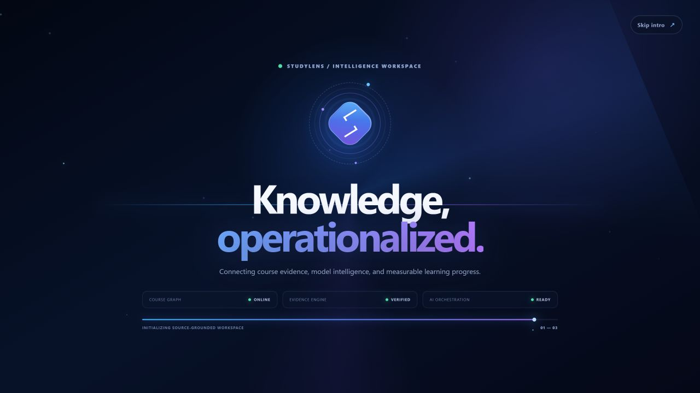
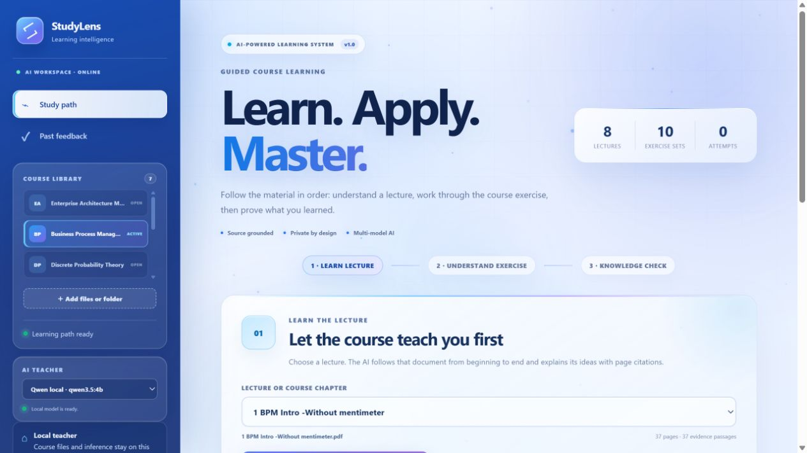
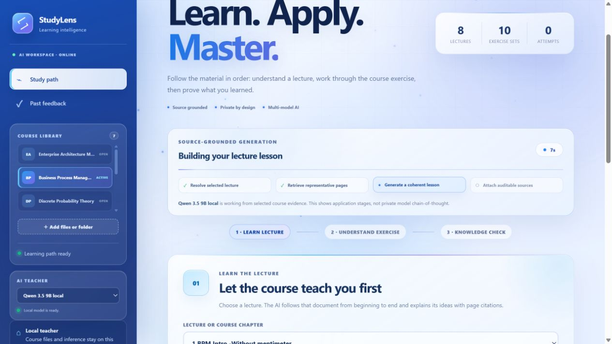
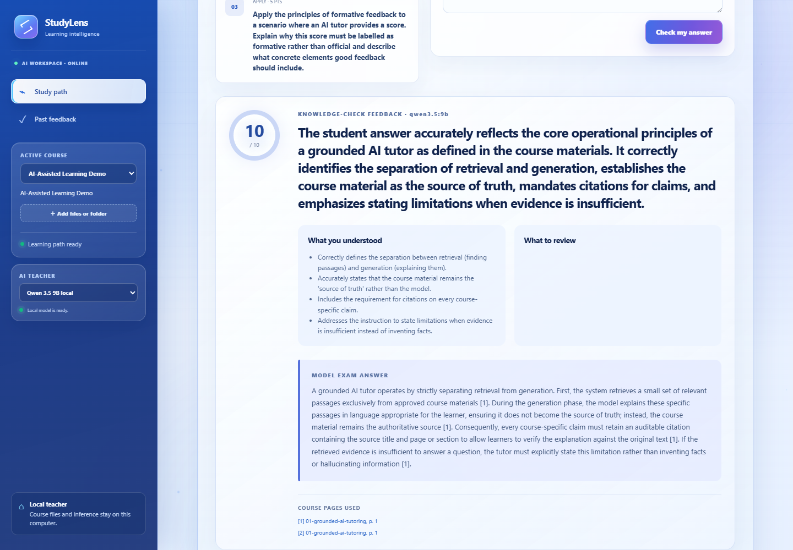
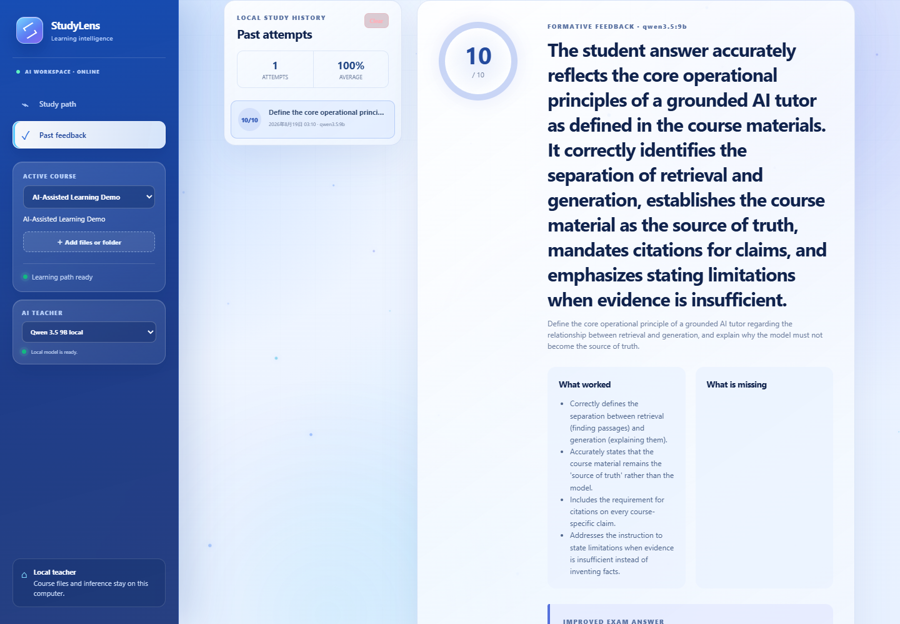
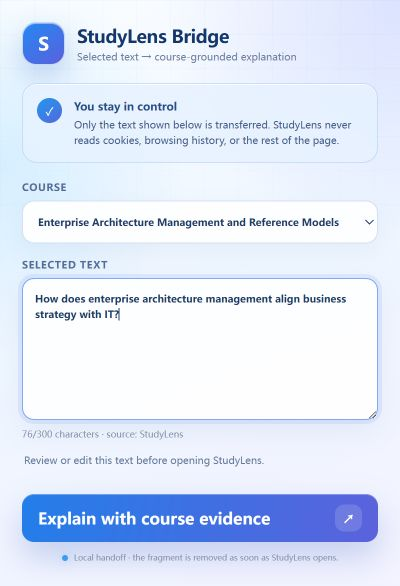
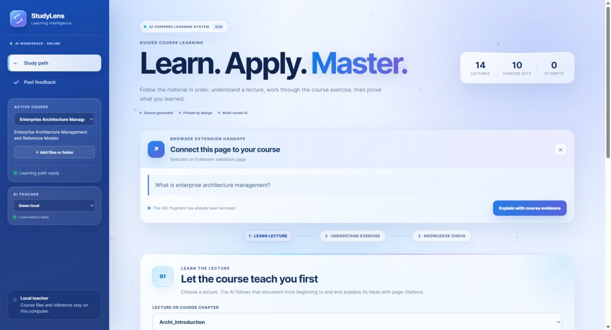
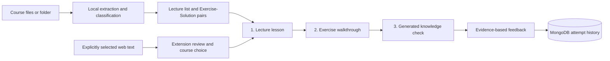

# StudyLens


StudyLens turns heterogeneous university course folders into a traceable, multi-course AI teaching workflow. Instead of behaving like a generic PDF chat box, it organizes lectures and exercise/solution pairs, teaches with page-level evidence, generates knowledge checks, grades answers against the same sources, and preserves attempt history.

Students can work in the full learning dashboard or explicitly hand selected web text to StudyLens through its Chrome/Edge extension. The system keeps ingestion, retrieval, model providers, teaching workflows, and MongoDB persistence behind separate boundaries so each part can be tested and replaced independently.

A clean clone includes a small original demo course and retrieval benchmark. The private reference deployment uses TUM's **Enterprise Architecture Management and Reference Models (INHN0017)** corpus: 52 PDFs, 926 pages, and 967 searchable chunks. Those copyrighted files and their extracted index remain local and are not committed.

<table>
  <tr>
    <td width="50%"></td>
    <td width="50%"></td>
  </tr>
  <tr>
    <td align="center"><strong>System-aware launch sequence</strong><br/>A brief, skippable initialization view establishes the workspace and visualizes the course, evidence, and AI layers.</td>
    <td align="center"><strong>Focused learning workspace</strong><br/>A luminous blue enterprise interface leads students through lecture, exercise, and knowledge-check stages.</td>
  </tr>
</table>

The interface uses a consistent blue-violet visual system, restrained pointer-responsive depth, staged workspace reveals, and state-aware micro-interactions. The launch sequence completes automatically in about three seconds, can be skipped immediately, locks the inactive workspace against accidental input, and is disabled when the operating system requests reduced motion.

<p align="center">
  
</p>
<p align="center"><strong>Transparent long-running generation</strong><br/>The workspace reports the real application pipeline and elapsed time while a local model works, then reveals the finished answer with a skippable typewriter effect. It does not claim to expose private model chain-of-thought.</p>

<table>
  <tr>
    <td width="50%"></td>
    <td width="50%"></td>
  </tr>
  <tr>
    <td align="center"><strong>Complete local lesson</strong><br/>A 3,828-character bilingual lecture generated from cited demo-course evidence.</td>
    <td align="center"><strong>Grounded formative feedback</strong><br/>A completed 10/10 knowledge check with strengths, an improved answer, and source links.</td>
  </tr>
</table>

<p align="center">
  
</p>
<p align="center"><strong>Persistent Past feedback</strong><br/>A fresh browser session reloaded the saved 10/10 attempt, full formative report, model provenance, and course-source links from MongoDB.</p>

<table>
  <tr>
    <td width="35%"></td>
    <td width="65%"></td>
  </tr>
  <tr>
    <td align="center"><strong>Explicit-selection bridge</strong><br/>Review or edit the selected text and choose its course before anything leaves the page.</td>
    <td align="center"><strong>Grounded dashboard handoff</strong><br/>The dashboard consumes the local fragment, removes it from the address bar, and offers a cited course explanation.</td>
  </tr>
</table>

The lesson and assessment screenshots are from a verified clean-clone run using the public demo course and local `qwen3.5:9b`. The course workspace and generation-progress views were re-captured from a real imported BPM folder after the cross-course compatibility pass. The Past feedback view was tested after opening a new browser session, confirming that the saved attempt survives beyond in-memory UI state. The extension handoff screenshots use the local EAM reference deployment. All screenshots use the same blue-violet product theme; private course files and extracted text are excluded from Git.

### Validated local runtime

The current reference machine has 16 GB RAM and an RTX 3060 Laptop GPU with 6 GB VRAM. Ollama loads `qwen3.5:9b` across 57% GPU / 43% CPU with a 4,096-token context. In the captured end-to-end run, the model produced the 3,828-character lecture in about 232 seconds, three structured questions in about 40 seconds, and grounded grading in about 47 seconds. The resulting attempt was then reloaded from MongoDB in a fresh browser session through Past feedback. Timings vary with thermals and other system load.

### Cross-course compatibility evidence

The ingestion pipeline was exercised against six unrelated local course folders rather than only the original EAM corpus. The folders included flat and nested layouts, English/German/Chinese path names, lecture decks, exercise sheets, solutions, mock exams, macOS metadata, and one unreadable PDF. All six produced a usable learning path after the compatibility pass:

| Course-family sample | Indexed documents | Pages/slides | Result |
|---|---:|---:|---|
| Business Process Management | 23 | 531 | 8 lectures, 10 exercise units; full HTTP import, search, and local-AI lecture smoke test passed |
| Discrete Probability Theory | 81 | 3,228 | indexed; sidecar metadata ignored |
| Embedded Systems | 49 | 777 | indexed with lectures, exercises, solutions, exam, and revision material |
| Linear Algebra | 46 | 276 | indexed from mixed PDF/DOCX folder; unsupported DOCX skipped |
| Microeconomics | 44 | 1,225 | indexed; 44 macOS AppleDouble PDF lookalikes ignored |
| Signal Processing | 41 | 538 | indexed with multilingual folder names |

This is compatibility evidence, not a claim that every possible university file will work. The current browser importer accepts PDF, PPTX, Markdown, and plain text, with limits of 100 accepted files, 50 MB per file, and 250 MB per course. Scanned image-only PDFs still need OCR, and DOCX is intentionally skipped.

## Product workflow



This is more than a PDF chatbot:

- retrieval is deterministic and evaluated separately from generation;
- the model receives only selected passages from the chosen lecture or exercise set;
- every generated workflow retains the original document and page;
- practice and grading use structured JSON rather than parsing prose;
- MongoDB stores the nested answer, feedback, model, and citation document as one attempt;
- the browser extension reads only text the user explicitly selects;
- model, AI provider, course catalog, and persistence adapter have separate boundaries.

## Implemented features

- file or whole-folder course import that preserves internal paths, ignores macOS/Office sidecars, and skips unsupported or unreadable files without rejecting the valid remainder;
- visible, scrollable course library for switching among multiple indexed subjects without rebuilding the application;
- PDF, PowerPoint, Markdown, and text ingestion with deterministic overlapping chunks;
- multilingual material classification for common English, German, and Chinese lecture/exercise/solution/exam naming patterns;
- BM25-style lexical retrieval and lecture/exercise/solution/exam filters;
- safe links back to the original local material page;
- inline PNG previews of cited PDF pages, generated and cached locally;
- document-scoped lecture teaching with page citations, examples, and exam-ready English wording;
- elapsed-time and pipeline-stage feedback during long model calls, followed by a reduced-motion-aware, skippable typewriter reveal;
- automatic pairing and walkthrough of course-provided exercises and solutions;
- course-grounded knowledge-check generation and formative grading;
- MongoDB-backed attempt history, aggregate score, reload, and user-controlled deletion;
- privacy-controlled Manifest V3 Chrome/Edge extension handoff with editable selection, course choice, and no cookie or history permission;
- selectable local Qwen3.5, OpenAI GPT, and Google Gemini providers;
- public demo corpus plus fixed retrieval evaluation cases;
- Python, C#, API, formatting, dashboard, and extension checks in CI.

## Run a clean clone

Requirements: Windows, Node.js, .NET 10, Python 3.12 for indexing/tests/page previews, Ollama, and MongoDB Community Server. The startup script installs the small Python packages in `tools/requirements.txt` if they are missing.

Install or start MongoDB:

```powershell
powershell -ExecutionPolicy Bypass -File scripts\setup-mongodb.ps1 -Install
```

Install and test the default local model:

```powershell
powershell -ExecutionPolicy Bypass -File scripts\setup-local-ai.ps1
```

Start the application:

```powershell
powershell -ExecutionPolicy Bypass -File scripts\run-local.ps1
```

Open `http://127.0.0.1:5080`. A clean clone starts with the committed **AI-Assisted Learning Demo** course. Keep the terminal open and press `Ctrl+C` to stop.

Use **Add files or folder** in the sidebar to import individual PDF, PowerPoint, Markdown, or text files, or select an entire course folder. The browser preserves its internal paths. Common English, German, and Chinese lecture/exercise/solution names help StudyLens build the learning sequence and pair sheets with their answers automatically. Unsupported files and system metadata are reported and skipped without blocking valid material. The copied files and index stay under the ignored local `App_Data/imported-courses` folder and are rediscovered after a restart.

The default model is local Qwen through Ollama. Every local and cloud profile is selectable. An unconfigured profile opens provider-specific connection guidance; teaching actions remain unavailable until its runtime or API key is ready:

```powershell
# Gemini free tier
powershell -ExecutionPolicy Bypass -File scripts\setup-cloud-ai.ps1 -Provider Gemini

# OpenAI API (billed separately from a ChatGPT subscription)
powershell -ExecutionPolicy Bypass -File scripts\setup-cloud-ai.ps1 -Provider OpenAI
```

The script hides keyboard input and stores the key in the Windows user environment, never in this repository. Restart StudyLens afterward. Cloud requests contain only the selected question, instructions, and retrieved course passages, not the original complete files. Check the provider's current billing, quota, and data-use terms before using private material; Gemini's free and paid tiers have different data handling.

`GET /health` reports both course readiness and the live persistence provider. The expected storage result is `MongoDb`, connected to the local `studylens` database.

## Prepare the private EAM reference course

```powershell
powershell -ExecutionPolicy Bypass -File scripts\setup-eam.ps1 `
  -SourcePath "D:\Courses\Enterprise Architecture Management and Reference Models (INHN0017)"
```

The generated index and absolute source path go into ignored local files. They never enter Git.

Add any other course in the same way:

```powershell
powershell -ExecutionPolicy Bypass -File scripts\setup-course.ps1 `
  -CourseId "linear-algebra" `
  -CourseName "Linear Algebra" `
  -SourcePath "D:\Courses\Linear Algebra"
```

No React or C# change is required to add a course.

## Install the browser extension

Build it once:

```powershell
cd frontend\extension
npm ci
npm run build
```

Then open `chrome://extensions` or `edge://extensions`, enable **Developer mode**, choose **Load unpacked**, and select `frontend\extension\dist`.

On any ordinary page, select a concept, right-click it, and choose **Explain “…” with StudyLens**. The context-menu click captures the explicit selection before the page loses focus, then opens the review popup. Choose a course and click **Explain with course evidence**. The toolbar button remains available as a fallback on pages that preserve their selection. Keep the local StudyLens server running at `http://127.0.0.1:5080`.

The Manifest V3 extension requests `activeTab`, `scripting`, `contextMenus`, and `storage`. The context menu appears only for a user selection, while `storage.session` temporarily holds that selection until the popup consumes and deletes it. It does not request cookies or browsing-history access and does not run a passive page content script. The reviewed text is placed in a local URL fragment, consumed by the dashboard, and immediately removed from the address bar.

Manual smoke-test checklist:

1. Open an ordinary webpage and select a short paragraph.
2. Right-click the selection, choose **Explain “…” with StudyLens**, and confirm that only that paragraph appears.
3. Edit the text if needed, choose a course, and click **Explain with course evidence**.
4. Confirm that the dashboard shows the Browser Extension Handoff card and the address bar no longer contains a `#from=extension` fragment.
5. Dismiss the card or request a course-grounded explanation and inspect its file/page citations.

The unpacked v0.3.1 build has been manually smoke-tested in Microsoft Edge across the selection context menu, review popup, and local dashboard handoff.

## MongoDB data model

The default repository is `MongoStudyAttemptRepository`; `LocalJsonStudyAttemptRepository` is an explicit fallback and test adapter, not the normal runtime path.

Each document in `studylens.study_attempts` contains:

- stable attempt ID and course ID;
- question and student answer;
- score, strengths, missing points, and improved answer;
- model name and full page-citation metadata;
- creation time.

A compound index on `(courseId, createdAtUtc descending)` supports course history. History is not committed to Git, and the UI exposes course-scoped deletion.

## Verification

```powershell
powershell -ExecutionPolicy Bypass -File scripts\verify.ps1
```

The current suite runs 8 Python indexing/rendering tests, 35 C# API/service tests, 4 Dashboard TypeScript tests, and 4 extension TypeScript tests: 51 automated tests in total. It also verifies .NET formatting plus lint and production builds for both React applications. CI deliberately uses fake AI providers and does not download multi-gigabyte model weights.

## Move to another computer

1. Push/clone this repository through GitHub.
2. Install MongoDB and Ollama on the new computer.
3. Copy private course files separately, then rerun `setup-course.ps1` for their new path.
4. Run `setup-local-ai.ps1`, `verify.ps1`, and `run-local.ps1`.
5. Expect a fresh local MongoDB history unless you separately export and import it.

GitHub synchronizes source code, the public demo, tests, and documentation. It intentionally does not synchronize private PDFs, model weights, local configuration, MongoDB student data, or this Codex conversation.

The validated default is `qwen3.5:9b` for a 16 GB Windows laptop with an RTX 3060 Laptop GPU (6 GB VRAM). It is the largest official Qwen3.5 Ollama profile that fits this machine without relying on a 17 GB-or-larger model image:

```powershell
powershell -ExecutionPolicy Bypass -File scripts\setup-local-ai.ps1
```

## API

| Method | Route | Purpose |
|---|---|---|
| `GET` | `/health` | course and MongoDB readiness |
| `GET` | `/api/courses` | configured courses and corpus status |
| `POST` | `/api/courses/import` | upload and locally index a new course |
| `GET` | `/api/courses/{courseId}/learning-path` | lectures and paired exercise/solution units |
| `GET` | `/api/courses/{courseId}/search?query=...` | ranked page evidence |
| `GET` | `/api/courses/{courseId}/chunks/{chunkId}` | complete retrieved passage for Dig in |
| `GET` | `/api/courses/{courseId}/documents/{documentId}` | safe original-material access |
| `GET` | `/api/courses/{courseId}/documents/{documentId}/pages/{page}/preview` | locally rendered cited-page image |
| `GET` | `/api/ai/status` | provider and model readiness |
| `POST` | `/api/courses/{courseId}/tutor/explain` | grounded bilingual teaching |
| `POST` | `/api/courses/{courseId}/tutor/lecture` | teach one selected lecture in sequence |
| `POST` | `/api/courses/{courseId}/tutor/exercise` | explain a course exercise with its solution |
| `POST` | `/api/courses/{courseId}/tutor/practice` | structured practice generation |
| `POST` | `/api/courses/{courseId}/tutor/grade` | formative feedback and persistence |
| `GET` | `/api/courses/{courseId}/history` | attempt metrics and recent records |
| `DELETE` | `/api/courses/{courseId}/history` | user-controlled course history deletion |

## Repository layout

```text
samples/                       public demo course and committed index
evals/                         fixed retrieval benchmark cases
tools/                         extraction, indexing, and Python tests
backend/StudyLens.Api/         ASP.NET Core API, retrieval, tutor, MongoDB
backend/StudyLens.Api.Tests/   unit, API, repository, and benchmark tests
frontend/dashboard/            React/TypeScript learning workspace
frontend/extension/            explicit-selection browser extension
scripts/                       setup, run, and verification automation
docs/                          local guide, handoff, and interview notes
```

## Safety and limitations

- Private material, local paths, model files, student work, and generated feedback are ignored by Git.
- AI feedback is study assistance, not an official course grade.
- Citations make output auditable; they do not guarantee the interpretation is correct.
- The lexical retriever can miss synonyms; hybrid semantic retrieval and OCR remain evaluation candidates.
- The project has engineering validation, but it does not yet claim measured learning-outcome improvement from a user study.
